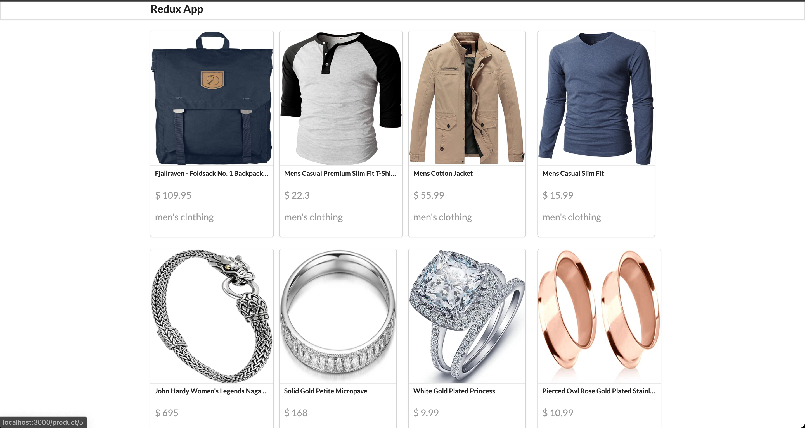
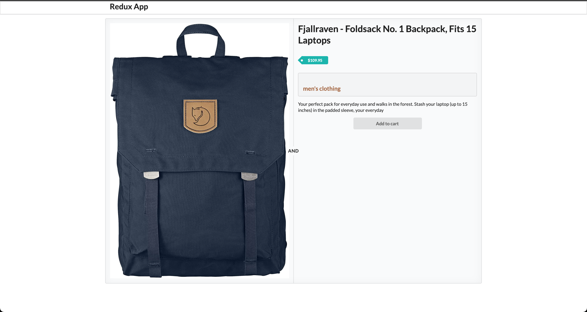

### Приложение магазин на redux

### API Used

[The Open Database APIs](https://fakestoreapi.com/docs)

- Method: `GET`
- Search URL: `https://fakestoreapi.com/products`
- Search URL id: `https://fakestoreapi.com/products/${productId}`

### Libraries used

- `semantic-ui`
- `axios`
- `react-js`
- `redux`
- `react-redux`
- `react-router-dom`

---

